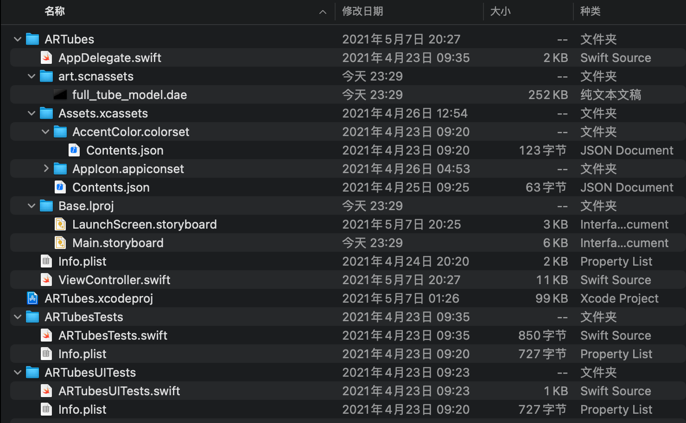
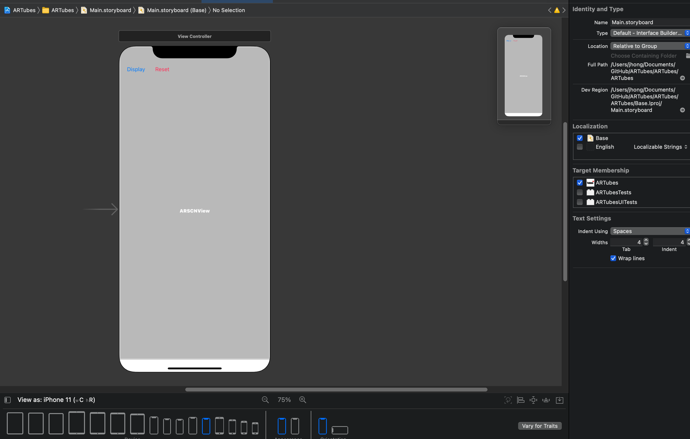

### ARTubes代码说明

<center>version 2.0 </center>

#### 文件结构

发给您的工程文件结构如下：



其中大部分文件为创建AR项目时生成的自带文件，我们的工程项目主要涉及到下面三个文件：

1. art.scnassets文件夹中的scn文件，为scenekit可以读取的3D模型文件
2. ViewController.swift，为界面功能的主要编码文件
3. Main.storyboard，为主界面的设计文件

其他的则有LaunchScreen.storyboard为启动界面，AppIcon.appiconset包含了自己画的一系列图标


#### 模型解释


根据这样的方式理解CAD图，提取轴线并进行建模，对于轴线的错误进行一部分修正后，将物件原点放置在其中的一个渠盖上


同时，预定义好定位剩余两个管道的另外两个渠盖的位置，方便之后的调用


#### Main.storyboard界面设计



两个按钮，一个label（用于显示所选信息），以及ARSCNView用于显示相机取景


#### 主代码ViewController.swift

为了方便管理，使用全局变量的方式，定义显示的变量种类和当前加入的模型中的所有信息

```swift
import UIKit
import ARKit
import SwiftUI

var display_name = false
var display_type = false
var display_diameter = false
var display_coordinate = false

var colist = [SCNVector3]()
var namelist = [String]()
var typelist = [String]()
var dlist = [Float]()
```

ViewController Class中定义了所有相关的方法，这一小段初始化了按钮、标签以及AR主界面，并为reset方法保存了配置

```swift

class ViewController: UIViewController, ARSCNViewDelegate {
    
    @IBOutlet weak var Tubes: UIButton!
    @IBOutlet var sceneView: ARSCNView!
    @IBOutlet weak var infolabel: UILabel!
    
    let configuration = ARWorldTrackingConfiguration()
```

Display方法，定义了DIsplay按钮按下后可以选择显示的变量，更改对应的属性，并在窗口消失之后执行一次刷新

```swift
    @IBAction func Display(_ sender: Any) {
        let alertController = UIAlertController(title: "Display Settings", message: "Tap to change the display status", preferredStyle: .actionSheet)
        var nametitle = "Display Tube Name: ON"
        var typetitle = "Display Tube Type: ON"
        var dtitle = "Display Diameter: ON"
        var cotitle = "Display Coordinate: ON"
        if !display_name {nametitle = "Display Tube Name: OFF"}
        if !display_type {typetitle = "Display Tube Type: OFF"}
        if !display_diameter {dtitle = "Display Diameter: OFF"}
        if !display_coordinate {cotitle = "Display Coordinate: OFF"}
        
        let dnameaction = UIAlertAction(title: nametitle, style: .default, handler: {_ in display_name = !display_name})
        alertController.addAction(dnameaction)
        let dtypeaction = UIAlertAction(title: typetitle, style: .default, handler: {_ in display_type = !display_type})
        alertController.addAction(dtypeaction)
        let daction = UIAlertAction(title: dtitle, style: .default, handler: {_ in display_diameter = !display_diameter})
        alertController.addAction(daction)
        let coaction = UIAlertAction(title: cotitle, style: .default, handler: {_ in display_coordinate = !display_coordinate})
        alertController.addAction(coaction)
        
        let cancelAction = UIAlertAction(title: "Cancel", style: .destructive, handler: nil)
        alertController.addAction(cancelAction)
        
        if let popoverController = alertController.popoverPresentationController {
            popoverController.sourceView = self.view
            popoverController.sourceRect = CGRect(x: self.view.bounds.midX, y: self.view.bounds.maxY, width: 0, height: 0)
            popoverController.permittedArrowDirections = []
        }
        self.present(alertController, animated: true, completion: nil)
        updatetext()
    }
```

viewDidLoad函数定义了在摄像头画面加载完成、空间信息建立、读取完成之后的事项，这边开启了参考平面和特征点的显示，viewWillAppear方法定义了对于水平平面的检测，并开启了它的显示，并且侦测用户有无对平面进行点击

```swift
    override func viewDidLoad() {
        super.viewDidLoad()
        // Set the view's delegate
        sceneView.delegate = self
        
        // Show statistics such as fps and timing information
        // sceneView.showsStatistics = true
        sceneView.debugOptions = [SCNDebugOptions.showWireframe, SCNDebugOptions.showFeaturePoints, SCNDebugOptions.showCreases]
    }
    
    override func viewWillAppear(_ animated: Bool) {
        super.viewWillAppear(animated)
        // Create a session configuration
        let configuration = ARWorldTrackingConfiguration()
        configuration.planeDetection = .horizontal
        UIApplication.shared.isIdleTimerDisabled = true
        self.sceneView.autoenablesDefaultLighting = true
        // Run the view's session
        sceneView.session.run(configuration)
        addGestures()
    }
```

如果用户点击了平面，则记录到了平面和点击的位置，通过建立raycastQuery方法，从点击的位置开始发射虚拟射线，获得这一位置和目标平面相交的点，将这一射线侦测情况作为raycast对象发送给loadGeometry函数加载模型

```swift
    func addGestures () {
        let tapped = UITapGestureRecognizer(target: self, action: #selector(tapGesture))
        sceneView.addGestureRecognizer(tapped)
    }

@objc func tapGesture (sender: UITapGestureRecognizer) {
        let tapLocation: CGPoint = sender.location(in: sceneView)
        let estimatedPlane: ARRaycastQuery.Target = .estimatedPlane
        let alignment: ARRaycastQuery.TargetAlignment = .any
        let query: ARRaycastQuery? = sceneView.raycastQuery(from: tapLocation, allowing: estimatedPlane, alignment: alignment)
        if let nonOptQuery: ARRaycastQuery = query {
            let result: [ARRaycastResult] = sceneView.session.raycast(nonOptQuery)
            guard let rayCast: ARRaycastResult = result.first
            else { return }
            self.loadGeometry(rayCast)
        }
    }
```

loadGeometry函数在获得ARRaycastResult之后，读取模型并获取到了原点和其子对象，对空间侦测结果转换成SCN三维坐标，将模型原点放置到对应地方，直接加减的坐标部分为通过3D图标点换算得到的坐标信息，并向全局变量中记录这一管道的对应信息：名字、种类、直径和原点坐标，并刷新文字显示。

```swift
func loadGeometry(_ result: ARRaycastResult) {
       guard let scene = SCNScene(named: "art.scnassets/full_tube_model.dae") else { print("Cannot load SCNScene") ; return }
        let node: SCNNode? = scene.rootNode.childNode(withName: "TapPosition", recursively: true)
        node?.scale = SCNVector3(0.1,0.1,0.1)
        node?.position = SCNVector3(result.worldTransform.columns.3.x, result.worldTransform.columns.3.y, result.worldTransform.columns.3.z)

        // TubeModel 1 info
        namelist.append("tube1");
        typelist.append("type_tube1")
        dlist.append(0.5)
        colist.append(SCNVector3(result.worldTransform.columns.3.x-11.3058, result.worldTransform.columns.3.y-0.3009, result.worldTransform.columns.3.z+7.0862))
        
        // TubeModel 2 info
        namelist.append("tube2");
        typelist.append("type_tube2")
        dlist.append(0.75)
        colist.append(SCNVector3(result.worldTransform.columns.3.x, result.worldTransform.columns.3.y, result.worldTransform.columns.3.z))
        
        // Tubemodel 3 info
        namelist.append("tubeset3");
        typelist.append("type_tube3")
        dlist.append(0.3)
        colist.append(SCNVector3(result.worldTransform.columns.3.x-1.8027, result.worldTransform.columns.3.y+0.087, result.worldTransform.columns.3.z-0.7108))
        
        self.sceneView.scene.rootNode.addChildNode(node!)
        updatetext()
    }
```

renderer方法实时的通过读取到平面，将其框选并创建文字节点Available Reference Plane（可用的参考平面）并实时渲染到模型上

```swift
 func renderer(_ renderer: SCNSceneRenderer, didAdd node: SCNNode, for anchor: ARAnchor) {
        
        let meshNode : SCNNode
        let textNode : SCNNode
        guard let planeAnchor = anchor as? ARPlaneAnchor else {return}

        
        guard let meshGeometry = ARSCNPlaneGeometry(device: sceneView.device!)
            else {
                fatalError("Can't create plane geometry")
        }
        meshGeometry.update(from: planeAnchor.geometry)
        meshNode = SCNNode(geometry: meshGeometry)
        meshNode.opacity = 0.6
        meshNode.name = "MeshNode"
        
        guard let material = meshNode.geometry?.firstMaterial
            else { fatalError("ARSCNPlaneGeometry always has one material") }
        material.diffuse.contents = UIColor.blue
        
        node.addChildNode(meshNode)
        
        let textGeometry = SCNText(string: "Available Reference Plane", extrusionDepth: 1)
        textGeometry.font = UIFont(name: "Futura", size: 75)
        
        textNode = SCNNode(geometry: textGeometry)
        textNode.name = "TextNode"
        
        textNode.simdScale = SIMD3(repeating: 0.0005)
        textNode.eulerAngles = SCNVector3(x: Float(-90.degreesToradians), y: 0, z: 0)
        
        node.addChildNode(textNode)
        
        textNode.centerAlign()
        print("did add plane node")
        
    }
    
    func renderer(_ renderer: SCNSceneRenderer, didUpdate node: SCNNode, for anchor: ARAnchor) {
        guard let planeAnchor = anchor as? ARPlaneAnchor else { return }

        let planeNode = node.childNode(withName: "MeshNode", recursively: false)

            if let planeGeometry = planeNode?.geometry as? ARSCNPlaneGeometry {
                planeGeometry.update(from: planeAnchor.geometry)
            }
    }
```

updatetext方法，读取全局变量中的信息，并在调用时更新label的显示：

```swift
func updatetext(){
        print("updating text")
        if (!display_name && !display_type && !display_coordinate && !display_diameter) {
            infolabel.text = " "
            return
        }
        infolabel.text = "[TubeInfo]\n"
        if namelist.count == 0 {
            infolabel.text! += "No Tubes Added"
            return
        }
        for index in 1...namelist.count{
            infolabel.text! += "[Tube\(index)]\n"
            if display_name {infolabel.text! += "Name:\(namelist[index-1])\n"}
            if display_type {infolabel.text! += "Type:\(typelist[index-1])\n"}
            if display_diameter {infolabel.text! += "Diameter:\(dlist[index-1])\n"}
            if display_coordinate {infolabel.text! += "Coordinate:\(colist[index-1])\n"}
        }
        return
    }
```

reset方法移除全部的模型信息、清除所有的模型并重新运行平面检测的程序，等于清空画面并重新获取、建立空间坐标

```swift
    @IBAction func Reset(_ sender: Any) {
        sceneView.session.pause()
        colist.removeAll()
        namelist.removeAll()
        typelist.removeAll()
        dlist.removeAll()
        updatetext()
        sceneView.scene.rootNode.enumerateChildNodes { (node, stop) in
            node.removeFromParentNode()
        }
        sceneView.session.run(configuration, options : [.resetTracking, .removeExistingAnchors])
    }
```

在程序外，通过extension的形式以及对运算符的重载，定义了SCNNode的中间显示方法，同时扩展了4D到3D变量的转换方法，定义了SCNVector3 三维变量的加法减法和除法，同时扩展了Int方法中从角度到弧度的转换方法。

```swift
extension SCNNode {
    func centerAlign() {
        let (min, max) = boundingBox
        let extents = ((max) - (min))
        simdPivot = float4x4(translation: SIMD3((extents / 2) + (min)))
    }
}

extension float4x4 {
    init(translation vector: SIMD3<Float>) {
        self.init(SIMD4(1, 0, 0, 0),
                  SIMD4(0, 1, 0, 0),
                  SIMD4(0, 0, 1, 0),
                  SIMD4(vector.x, vector.y, vector.z, 1))
    }
}

func + (left: SCNVector3, right: SCNVector3) -> SCNVector3 {
    return SCNVector3Make(left.x + right.x, left.y + right.y, left.z + right.z)
}
func - (left: SCNVector3, right: SCNVector3) -> SCNVector3 {
    return SCNVector3Make(left.x - right.x, left.y - right.y, left.z - right.z)
}
func / (left: SCNVector3, right: Int) -> SCNVector3 {
    return SCNVector3Make(left.x / Float(right), left.y / Float(right), left.z / Float(right))
}
extension Int {
    var degreesToradians : Double {return Double(self) * .pi/180}
}
```

余下的代码均为AR项目默认，因此未做修改

